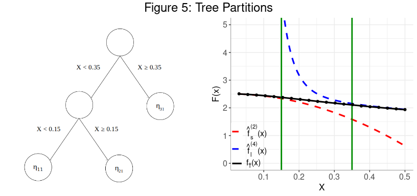

BART Model Mixing Priors
================
John Yannotty
11-18-2022

<style type="text/css">
  body{
  line-height: 2
  }
</style>
## Objective

This document serves as an online supplement to the article “Model
Mixing Using Bayesian Additive Regression Trees” by Yannotty et
al. (2022). The goal of this document is to illustrate the difference
between the proposed informative and non-informative priors for the
BART-based model.

## Introduction

Assume

are independent and identically distributed (iid) random variables
originating from the true and underlying data generating mechanism

 + \epsilon_i \quad \text{where} \;\; \epsilon_i \stackrel{iid}{\sim}N(0,\sigma^2)")

and
")
is the true and unknown physical system evaluated at input
.
Consider a set of models
,\ldots,f_K(x_i)"),
each of which are designed to explain the physical system across some
region of the domain. Assuming each model has been fit, the mean
predictions at inputs

are given by
,\ldots,\hat{f_K}(x_i)")
for
.
Using the information from these mean predictions, the field data is
modeled as

\hat{f_l}(x_i) + \epsilon_i \quad \text{where} \;\; \epsilon_i \stackrel{iid}{\sim}N(0,\sigma^2).")

The weight functions
 = \big(w_1(x_i),\ldots,w_K(x_i)\big)^\top")
are modeled using a sum-of-trees where

is the jth tree and

is the corresponding set of terminal node parameters. The output of each
tree can be expressed as a piecewise constant function

 = \sum_{p = 1}^{P_j} \boldsymbol\mu_{pj} \boldsymbol 1_{x_i \in \eta_{pj}}")

where

is the number of terminal nodes in
,

is the pth terminal node in
,

is the terminal node parameter associated with this node, and

is the indicator function that

lies within the hyper-rectangle defined by
.

The BART model mixing framework has the option to specify either an
informative or non-informative prior for the terminal node parameters
depending on the available information in the model set. The current
implementation of the informative prior is tailored to Effective Field
Theories (EFTs), which are techniques used to model physical systems of
interest. This method is described in detail by Yannotty et al. (2022).

In general, consider the jth tree,

with terminal nodes

(assuming

has

terminal nodes). Each terminal node is associated with a parameter
.
This parameter is the contribution to the weight functions
,\ldots,w_K(x)")
from the jth Tree for those observations that are assigned to the
hyper-rectangle defined by

where
.
In general, the parameter is assigned the prior

")

where
^\top \in \mathbb{R}^K")
and

is the

identity matrix. The diagonal covariance structure implies that the

components of

are independent conditional on the tree. Furthermore, for fixed
,
this implies the weight functions
,\ldots,w_K(x)")
are also conditionally independent.

The two different types of priors are illustrated throughout this
article. **See Yannotty et al. (2022) for a detailed discussion on the
calibration of the hyperparameters

and

with either prior.** Before discussing these details, we briefly
summarize our motivating example involving EFTs.

## Motivating Example:

Assume 20 training points

are generated at inputs

according to

Consider a model set containing the 2nd order weak coupling expansion,
}(x)"),
and the 4th order strong coupling expansion,
}(x)").
Given this set of EFTs, the data is modeled as

\hat{f_s}^{(2)}(x_i) + w_2(x_i)\hat{f_l}^{(4)}(x_i) + \epsilon_i, \quad \text{where} \;\; \epsilon_i \stackrel{iid}{\sim}N(0,\sigma^2)")

and
}(x)")
and
}(x)")
are the mean predictions from each EFT. The mean predictions are shown
below in Figure 1. Clearly, each model provides high fidelity
predictions in one region, yet diverges elsewhere.


Each EFT has an associated stochastic truncation error,
"),
which indicates its level of accuracy for predicting the true system. In
areas where
")
has a high variance, the corresponding EFT provides a poor approximation
of the physical system. For simplicity, we use the pointwise error
approximation described by Semposki et al. (2022) to fit the two EFTs in
this example. The weak and strong coupling expansions under
consideration are shown in Figure 2 with their associated 95% pointwise
confidence intervals. Clearly, when an EFT provides a poor approximation
of the system its mean prediction diverges and its corresponding
variance from the truncation error is high. Note, the mean predictions,
")
and
"),
at the training points

are represented as points on the respective curves below.

  


## Non-Informative Prior:

### Summary:

**Objective:**

- The non-informative prior is designed to work for any model mixing
  problem where the mean predictions,
  ,\ldots,\hat{f_K}(x)"),
  from each model are obtainable. This method does not require any
  additional information from the model set.

- The hyperparameters in each terminal node model are calibrated by
  considering the entire sum-of-trees model.

**Model:**

- ")
  where
  ^\top")
  and
  ^\top").

- The prior induced by the indepdent and identically distributed (iid)
  assumption and the sum-of-trees implies
  \mid T_j \stackrel{iid}{\sim}N(m\beta_l, m\tau^2)")
  for
  .

- The hyperparameters are calibrated as
  
  and
  
  for
  
  and tuning parameter
  .

### Prior Predictions with a Non-Informative Prior

With the non-informative prior,
\mid T_j \stackrel{iid}{\sim}N(\frac{1}{2}, m\tau^2)")
for

at any fixed

where
.
As a starting point, we can observe the pointwise prior predictions of
the weight functions and the induced mean prediction of the physical
system. Both of these features are shown below for

and a 10-tree model
(i.e. ).
Clearly, the weight functions lie on top of each other with a 95%
confidence interval ranging from (0, 1). Meanwhile, the prior prediction
of the system is merely an average of the two EFTs. Hence, under the
non-informative prior, the observational data is forced to play a
prominent role in the posterior prediction in order to adequately
recover the true system.

  


  

## Informative Prior:

### Summary:

**Objective:**:

- The informative prior allows the user to directly incorporate
  information regarding each models localized predictive performance
  into the prior of the terminal node parameters.

- This prior considers the effect of an individual parameter/tree on the
  overall weight.

- The current implementation is tailored to EFT models by leveraging the
  information available in the truncation errors.

**Model:**

- ")
  where
  ^\top")
  and
  ^\top").

- Allow
  
  to change based on the partitions induced by the tree, where
  .

- Fix
  
  so that each tree explains
  
  of the variation in the weight functions.

  

### Illustrating the Prior Calibration

The follow steps demonstrate how the terminal node hyperparameters for a
given tree are calibrated during the MCMC. For this example, assume a
10-tree model
()
with the tuning parameter
.
Specifically, we will focus on calibrating the terminal node parameters
for the first tree in the ensemble,
.
The same steps can be taken to calibrate the priors of the terminal node
parameters in the remaining nine trees.

  

#### **Step 1: Initial Pointwise Estimates of the Weights**

Each EFT is associated with a truncation error which indicates the
model’s localized predictive accuracy. The predictive accuracy of the
true system is inversely related to the variance of the truncation
error. This can easily be observed by looking at the results in Figures
1 and 2. We can use this information and a precision weighting scheme to
provide an initial guess for each model weight. In particular, define
")
and
")
as the initial guesses for
")
and
")
respectively. Each function can be defined by

 = \frac{1/v_l(x_i)}{1/v_1(x_i) + 1/v_2(x_i)}, \quad l = 1,2.")

This precision weighting scheme can be applied at each of the 20
training inputs

before the mixed-model is trained and the weight functions are learned.
Using this initial guess, we can interpret
")
as the prior mean for its corresponding weight,
i.e.  \stackrel{ind}{\sim}N\big(\beta_l(x_i), \tau^2\big)")
for each

and
.
The plots below illustrate the pointwise prior mean weights
")
at each of the training points along with the pointwise prior
prediction, which is given by

 = \beta_1(x)\hat{f_s}^{(2)}(x) + \beta_2(x)\hat{f_l}^{(4)}(x).")

Similar to the non-informative prior, these results are shown for

and

trees.

  


From this, we see the pointwise prior precision weights suggest the
weight functions
")
and
")
should take a sigmoid-like shape in order to properly predict the
system. Even though the pointwise prior prediction leaves much to be
desired in the intermediate range of the domain, it is a clear
improvement compared to the initial prediction under the non-informative
prior. The precision based weights appear to be a useful source of
information and at least can be used to guide the learning process with
the BART-based mixing. Rather than starting with a mean of
,
the weights start at more realistic values and with a useful shape that
can be refined with the observational data. Thus, the posterior
predictions can borrow information from the prior and the observational
data to adequately recover the true system. This is not the case when
using a non-informative prior as described in the previous section, as
the solution is very dependent on the observational data.

  

#### **Step 2: Condition on a Tree Structure**

Consider calibrating the terminal node parameter priors for the first
tree in the ensemble,
.
For each node, the prior is defined conditional on the tree structure.
Thus, for this demonstration, assume

has the structure shown below:



This is a shallow tree with three terminal nodes, hence the 20 training
points are divided into three partitions. These partitions of the input
space are explicitly shown by the green vertical lines in the right
panel of Figure 5.  
Based on the tree and the induced partitions, we can make the following
observations. Recall, this example uses 10 different trees in the
sum-of-trees model, thus each tree is expected to explain

of the variation in the total weight functions. As a result, we expect
the terminal node parameters for one tree to prefer the interval
![\[0, 0.1\]](https://latex.codecogs.com/png.image?%5Cdpi%7B110%7D&space;%5Cbg_white&space;%5B0%2C%200.1%5D "[0, 0.1]").

Comments:

1.  Partition 1
    (,
    ):
    The second order weak coupling expansion,
    }(x)"),
    aligns very closely to the true system while the fourth order strong
    coupling expansion,
    }(x)"),
    diverges and is far from the true system. From Figure 2, this
    relationship can also be discerned from the truncation errors. In
    terms of the terminal node parameters (i.e. this tree’s contribution
    to each model weight) we would expect
    
    to take values close to 1 and
    
    to take values close to 0 for any
    
    in this subregion.

2.  Partition 2
    (,
    ):
    The true system lies between both EFTs across this region. For
    
    closer to 0.15,
    }(x)")
    provides a more accurate prediction that
    }(x)").
    The reverse behavior is observed for
    
    closer to 0.35. This relationship can also be inferred from the
    truncation errors. Thus, we expect
    
    and
    
    should take values towards the away from the extremes of
    
    and
    .

3.  Partition 3
    (,
    ):
    }(x)")
    yields high fidelity predictions of the true system in this
    subregion, while
    }(x)")
    slowly diverges. Thus, we can expect
    
    to take low values close to
    
    and
    
    to take values close to
    .

In the informative prior, the goal is to build this intuition into the
prior mean of the terminal node parameters. This can be accomplished by
utilizing the prior mean weight functions
")
and
")
which are based on the variances of the truncation errors.

  

#### **Step 3: Calibrating the Prior Mean**

Conditional on

from Step 2, we see there are three prior means which need to be
specified:

and
.
In this problem, each mean vector

is a two-dimensional vector with components

and

where
.

Now consider one of the partitions induced by the tree. For simplicity,
focus on the first partition defined by
,
which includes the first five training points
,\ldots,(x_5, y_5)").
As described in Step 2, the weak coupling expansion should be given a
weight near one while the effect of the strong coupling expansion should
be shrunk towards zero. To express this idea mathematically, the prior
mean vector is set as:

}{5}  \quad \text{and} \quad \beta_{112} = \frac{1}{10}\sum_{i = 1}^5\frac{\beta_2(x_i)}{5}")

This calibration sets the prior means of the terminal node parameters

and

to be the sample means of the pointwise precision based weights from the
EFTs scaled by the number of trees (10). The scaling of

is used to ensure each tree explains approximately

of the variation in the model weights.

The same procedure is used to calibrate the remaining prior mean vectors

and
.
The calibrated values are shown below. Note, results have been rounded.

#### 

<!-- ##### Terminal Node Means -->
<!-- ```{r} -->
<!-- beta_df = data.frame(beta1,beta2,beta3) -->
<!-- beta_df = round(beta_df, 4) -->
<!-- rownames(beta_df) = c('$\\beta_{1}$ Component','$\\beta_{2}$ Component') -->
<!-- colnames(beta_df) = c('$\\eta_{11}$','$\\eta_{21}$','$\\eta_{21}$') -->
<!-- beta_df %>% kable() %>%  -->
<!--   kable_paper(full_width = F, position = 'center') %>%  -->
<!--   add_header_above(c("Prior Means by Terminal Node in $T_1$"=4)) -->
<!-- ``` -->
<!-- ##### Pointwise Data by Node -->
<!-- ```{r} -->
<!-- pw_df = data.frame(Input = ex1_data$x_train, betax) -->
<!-- colnames(pw_df)[1:3] = c('$x_i$','$\\beta_{1}(x)$','$\\beta_{2}(x)$') -->
<!-- pw_df = round(pw_df,6) -->
<!-- pw_df[,2] = ifelse(pw_df[,2] == 1, "1.0", as.character(format(pw_df[,2],scientific = F))) -->
<!-- pw_df[,3] = ifelse(pw_df[,3] == 1, "1.0", as.character(format(pw_df[,3],scientific = F))) -->
<!-- pw_df[,2] = ifelse(as.numeric(pw_df[,2]) == 0, "0", as.character(format(pw_df[,2],scientific = F))) -->
<!-- pw_df[,3] = ifelse(as.numeric(pw_df[,3]) == 0, "0", as.character(format(pw_df[,3],scientific = F))) -->
<!-- pw_df %>% kable(escape = F, align = 'c') %>%  -->
<!--   kable_paper(full_width = F) %>%  -->
<!--   add_header_above(c("Pointwise Prior Mean Values by Terminal Node in $T_1$"=3)) %>%  -->
<!--   pack_rows("Node 1", 1, 5) %>% -->
<!--   pack_rows("Node 2", 6, 13) %>% -->
<!--   pack_rows("Node 3", 14, 20) %>%  -->
<!--   scroll_box(height = "400px") -->
<!-- ``` -->

  

#### **Step 4: Calibrating the Prior Standard Deviation**

The standard deviation,

does not change based on the tree partitions. Thus, it is selected so
that the confidence interval width for any terminal node parameter

is
.
Assuming a symmetric confidence interval, this idea is expressed as:


Solving either equation implies
.
With

and
,
we have
.

  

### Plotting the Prior

The joint prior distribution of

and

for each

are shown below in Figure 6. Each plot illustrates a bivariate normal
distribution with standard deviation
.
The contours in each plot represent the number of standard deviations
from the mean. The clear difference between each prior is the location
of the center of the distribution. In the first node, the prior is
centered around
")
which indicates the prior belief that second order expansion is closely
aligned with the true system in this region while the fourth order
expansion diverges. The joint distribution in the second panel is
centered around
")
which indicates the second order expansion has the better overall
performance in this middle subregion compared to the fourth order
expansion. Finally, the third distribution is centered around
")
which indicates the fourth order expansion is the appropriate model in
this region. In summary, it appears the prior distributions shown below
match our intuition about how the models should be mixed given the tree
structure defined by
.

  


  

### Prior Predictions with an Informative Prior

Given the priors define in the steps above, now consider the prior
weight functions and mean predictions associated with
.
The prior mean predictions are given by

 = \beta_{p11}\hat{f_s}^{(2)}(x_i) + \beta_{p12}\hat{f_l}^{(4)}(x_i) \quad \text{if} \;\; x_i \in \eta_{pj}, \;\; p=1,2,3.")

Note, Figure 7 illustrates the contribution of
,
as opposed to the result of the entire sum-of-trees. Thus, the y-axis
scale in Figure 7 is smaller than the plots displayed earlier. The prior
distributions of

and

are shown as a function of

and exhibit the piecewise function defined by each tree. The right panel
shows the contribution to the overall mean prediction from
.
The prior mean prediction with the informative prior is shown in purple,
while the prior mean prediction from the non-informative prior is shown
in orange. It appears the mean prediction from

under the informative prior begins to embody the general shape of the
true function. This is a noticeable improvement than the result shown
from the non-informative prior where each terminal node parameter is
centered at
.
This yields an average of the predictions from the individual EFTs and
clearly diverges in the rightmost portion of the domain.

  


